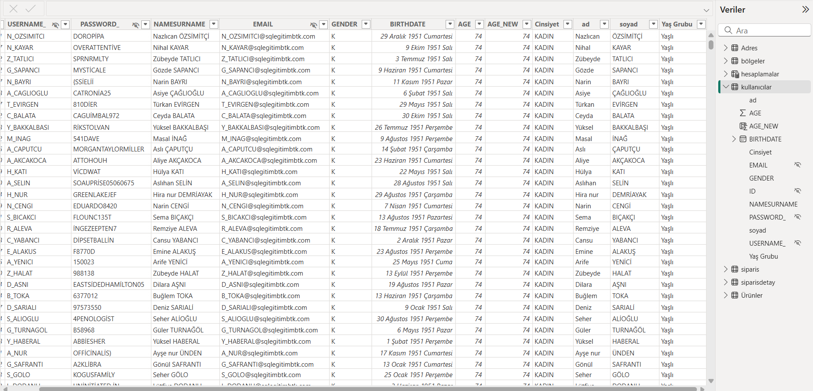
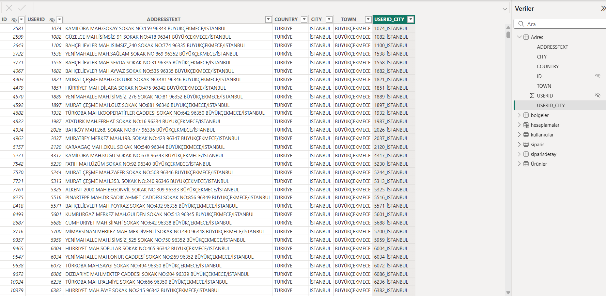
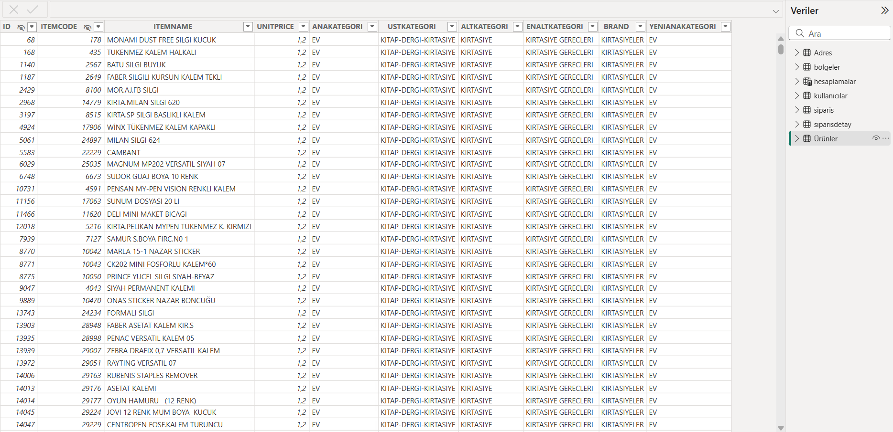
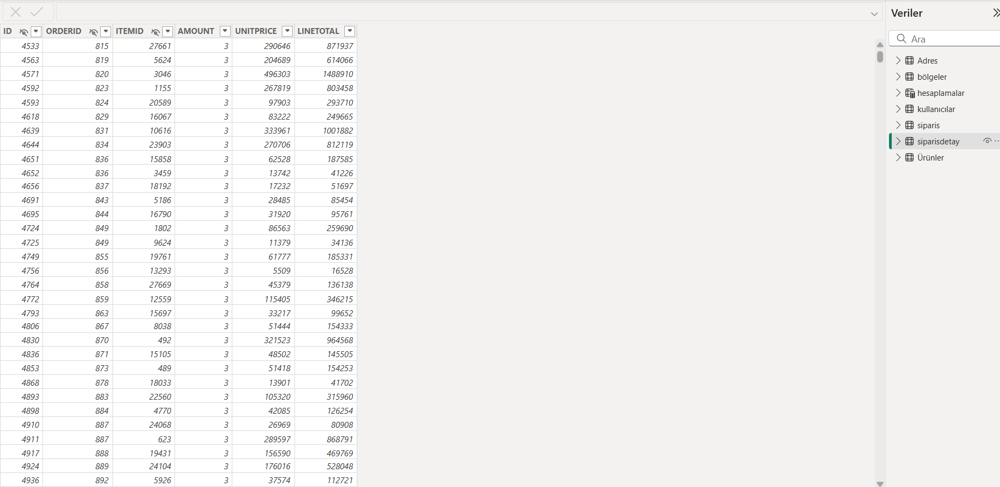
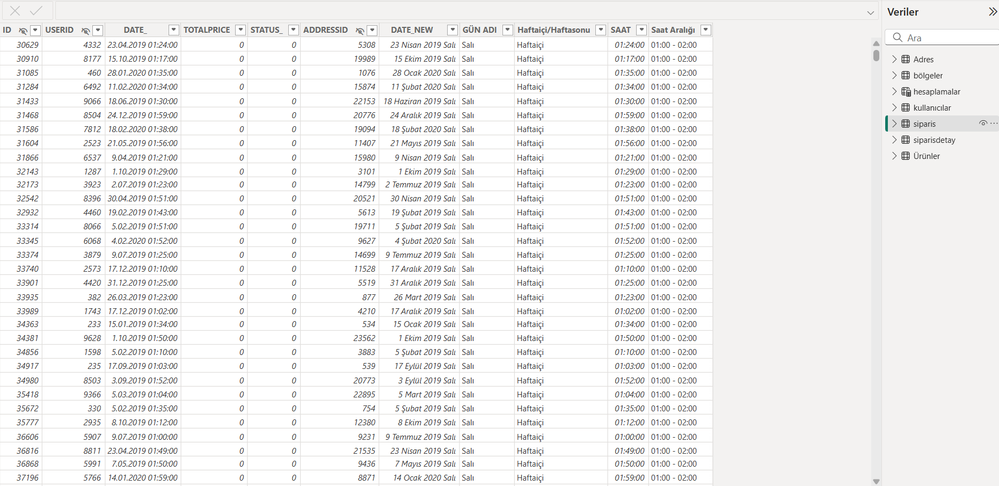
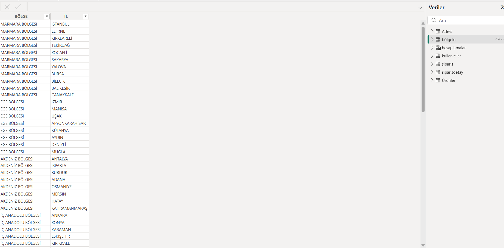
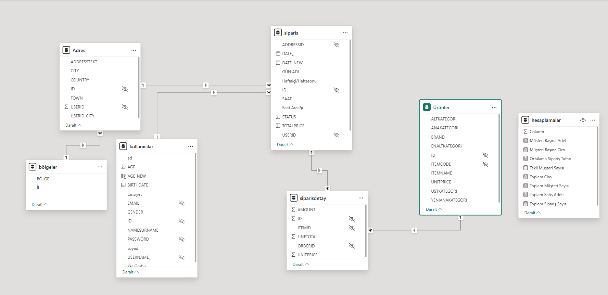
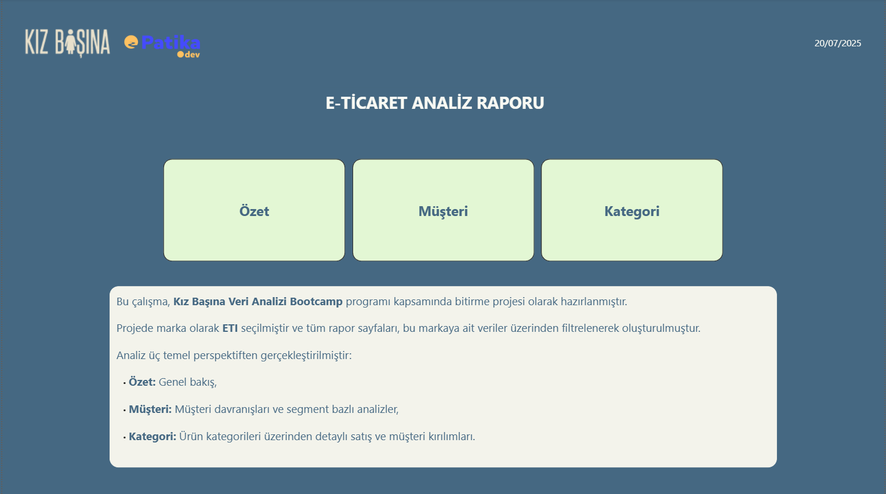
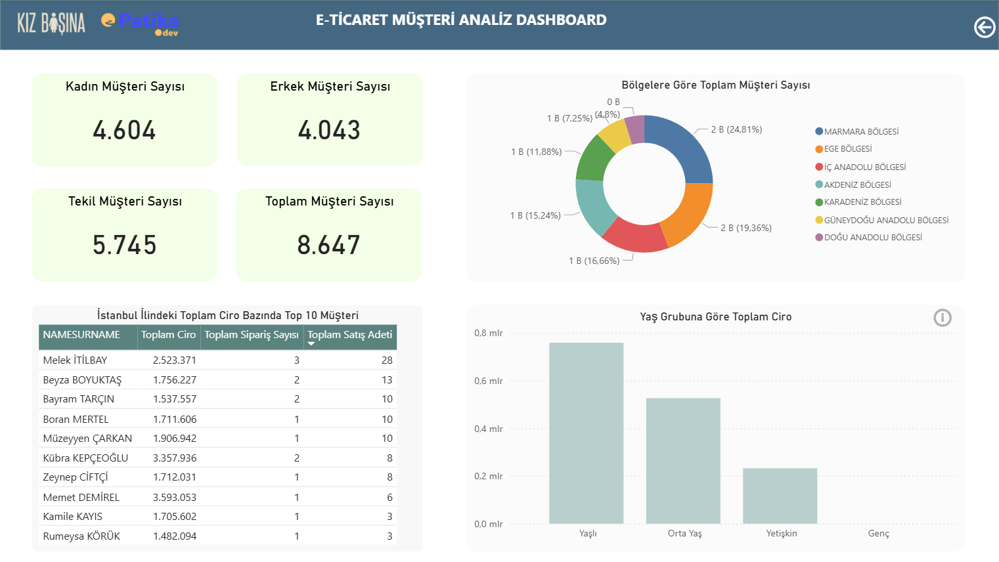
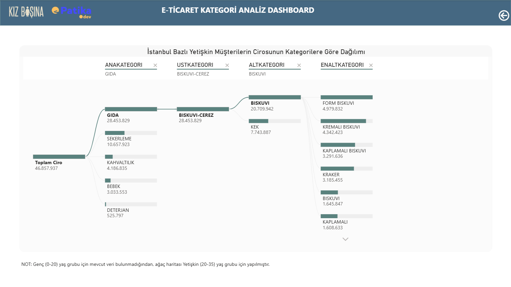

# 📘 Proje Raporu: E-Ticaret Analiz Dashboardu (Power BI)

Bu döküman, Power BI ile geliştirilen e-ticaret analiz dashboardunun oluşturulma sürecini, kullanılan DAX ifadelerini ve analiz yaklaşımlarını detaylı biçimde açıklamaktadır.

---

## 1. 🔍 Proje Amacı

Bu projenin amacı, bir e-ticaret verisi üzerinden kullanıcı davranışlarını, satış performansını ve ürün kategorilerine dair trendlerini belli bir marka bazında analiz etmek ve görselleştirmektir. Bu projede filtrelenen marka ETI olarak seçilmiştir.

---

## 2. 📁 Veri Ön Hazırlığı

- Kaynak: Excel/CSV dosyası
- Veriler Öncelikle Python üzerinden analiz edildi, yalnızca Ürünler tablosunun CATEGORY4 kolonunda eksik veri tespit edildi fakat analize engel olmayacağı için müdahale edilmedi.
- Eksik veri dışında duplikasyon ve şüpheli değerler gözlemlenmedi.
- Veriler Power Query aracılığıyla içeri aktarıldı.
- Proje süresince SQL üzerinden veri konfirmasyonu yapıldı.
  
🗂️ **Users Tablosu**  
- Tablo adı kullanıcılar olarak değiştirildi.  
- Veri türlerinin doğruluğu kontrol edildi, BIRTHDATE kolonun türü tarih olarak değiştirildi.
- Dax formülü ile kullanılıların yaşı hesaplatıldı; AGE_NEW = DATEDIFF('kullanıcılar'[BIRTHDATE], TODAY(), YEAR).
- Cinsiyet adında yeni bir koşullu sütun oluşturuldu ve 'E' yazan satırlara 'ERKEK', 'K' yazan satırlara 'KADIN' yazdırıldı.
- NAMESURNAME sütunu çoğaltıldı, isim-soyisim ayıklanarak ad ve soyad adlı iki ayrı kolon oluşturuldu.
- 'CREATEDDATE', 'TELNR2' kolonları kaldırıldı.
- 'PASSWORD_' kolonunun değerleri büyütüldü.
-  Modelleme kısmında ise ID, PASSWORD_ ,USERNAME_ ve EMAIL kolonları gizlendi.
-  Koşullu sütun ile AGE kolonu segmentlere ayrıldı ve Yaş Grubu adında yeni bir kolon oluşturuldu.


🗂️ **adres Tablosu**  
- Tablonun adı Adres olarak değiştirildi.
- Veri tipleri sorunsuzdu.
- Power Query ile USERID ve CITY kolonları birleştirildi.  


🗂️ **İtems Tablosu**  
- Tablonun adı Ürünler olarak değiştirildi.
- Kategori isimleri yeniden düzenlendi.


🗂️ **OrderDetail Tablosu**  
- Tablonun adı siparisdetay olarak değiştirildi.
- Veri tipleri kontrol edildi.


🗂️ **Orders Tablosu**  
- Tablonun adı siparis olarak değiştirildi.
- Veri tipleri kontrol edildi.
- DATE_ kolonu çoğaltıldı ve Tarih formatına getirildi.
- Haftaiçi ve Haftasonu verilerini ayrı değerlendirebilmek için 'Haftaiçi/Haftasonu' adında koşullu bir sütun oluşturuldu.
- Saat bazlı analizi daha okunabilir yapabilmek adına DATE_ kolonundan SAAT kolonunu ayıkladımi SAAT kolonunu da Saat Aralığı kolonu altında gruplandırdım.


🗂️ **bölgeler Tablosu**  
- İnternetten bulunan 81 ilimize ait bölgeler tablosu Power BI içerisine aktarıldı.
- Veri tipleri kontrol edildi.
- İL kolonunun karakterleri büyütüldü.

---

## 5. 🧩 Veri Modeli (Tablolar Arası İlişkiler)

- Veri modelinde 7 temel tablo kullanıldı: `siparis`, `siparisdetay`, `ürünler`, `kullanıcılar`, `Adres`, `bölgeler`, `hesaplamalar`
- Tablolar arası ilişkiler kuruldu.
- Kullanıcıların kullanmayacağı tüm alanları gizlendi.


---

## 3. 📊 Dashboard Sayfaları

### 🏠 Giriş Sayfası
- Projeye dair genel açıklama ve sayfa yönlendirmeleri.


### 🧾 Özet Sayfası
- KPI kartları
- Zaman serisi grafiklerle satış eğilimleri


### 🧍‍♀️ Müşteri Sayfası
- Segment bazlı müşteri analizleri
- Yaş, cinsiyet gibi demografik kırılımlar


### 📦 Kategori Sayfası
- Ürün bazlı satış performansı
- Kategori bazlı filtreler

---

## 4. Kullanılan DAX Formülleri

```dax
🔹 Müşteri Başına Adet = CALCULATE([Toplam Satış Adeti]/[Tekil Müşteri Sayısı])

🔹 Müşteri Başına Ciro = CALCULATE([Toplam Ciro]/[Tekil Müşteri Sayısı])

🔹 Ortalama Sipariş Tutarı = CALCULATE([Toplam Ciro]/[Toplam Sipariş Sayısı])

🔹 Tekil Müşteri Sayısı = CALCULATE(
    DISTINCTCOUNT(siparis[USERID]),
    FILTER(
        siparisdetay,
        RELATED('Ürünler'[BRAND]) IN VALUES('Ürünler'[BRAND])
    )
)

🔹 Toplam Ciro = CALCULATE(SUM(siparisdetay[LINETOTAL]), KEEPFILTERS(VALUES('Ürünler'[BRAND])))

🔹 Toplam Müşteri Sayısı = CALCULATE(
    COUNT(siparis[USERID]),
    FILTER(
        siparisdetay,
        RELATED('Ürünler'[BRAND]) IN VALUES('Ürünler'[BRAND])
    )
)

🔹 Toplam Satış Adeti = CALCULATE(SUM(siparisdetay[AMOUNT]), 
KEEPFILTERS(VALUES('Ürünler'[BRAND])))

🔹 Toplam Sipariş Sayısı = CALCULATE(COUNT(siparisdetay[ORDERID]),
KEEPFILTERS(VALUES('Ürünler'[BRAND]))
)

